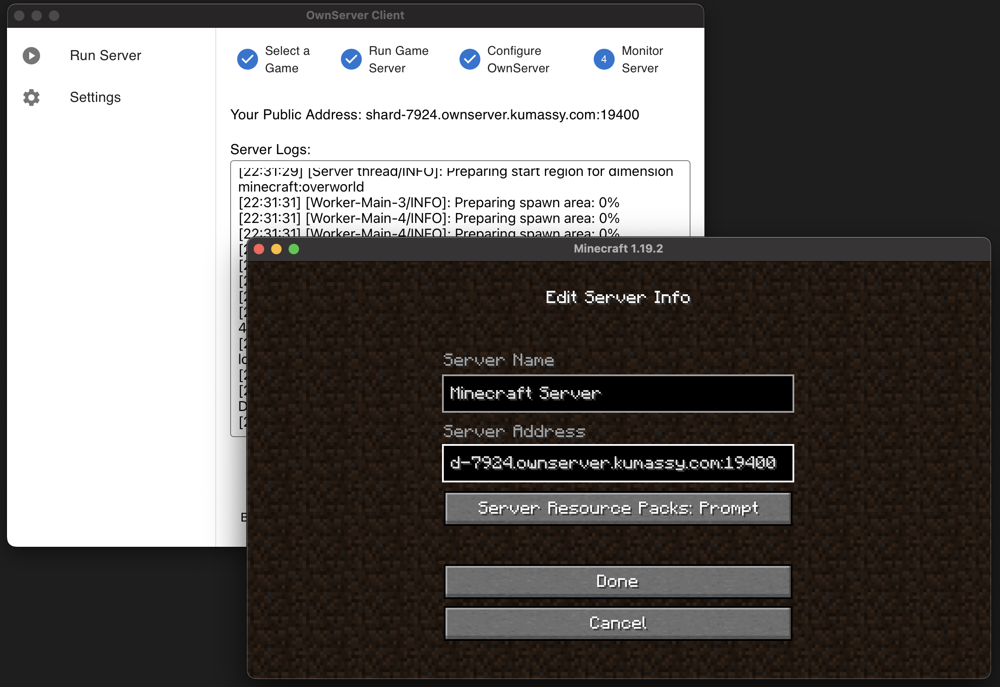

# OwnServer Client GUI


## Overview


This software aims to minimize cost and effort to prepare local game server like Minecraft, Factorio, RUST and so on.

- Cost you'll save
  - You can utilize any redundunt compute resource for game server as long as they can connect *to* the Internet.
  - You can save cost for Cloud, VPS.
- Effort you'll save
  - No firewall, NAT settings is required.


This repository provides [GUI application](https://github.com/Kumassy/ownserver-client-gui), which is the frontend of [ownserver](https://github.com/Kumassy/ownserver)

## Prerequisite
| Game | Requirement |
|:--|:--|
| Minecraft | `java` installed |
| Factorio | `docker` installed |


## Installation 
Pick the latest release from here: https://github.com/Kumassy/ownserver-client-gui/releases

for Windows user, download `*.msi`.  
for macOS user, download `*.dmg`.  
for Linux user, download `*.AppImage`.

## Contributing
This software uses [tauri](https://tauri.studio/) framework. Read about tauri [here](https://tauri.studio/docs/about/intro/).

### Build
```
yarn install
yarn tauri dev # run app in debug mode
yarn tauri build # build app for release
```

### Issue, PR
Feel free to open Issues and Pull Requests!


## License
MIT
