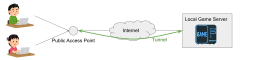

# PlayHub Client GUI


Expose your local game server to the Internet

Project Status: Alpha release

## Overview


This app creates a private tunnel between our server and your local game server. Our server forwards requests from your friends to your local server. No global IP address, firewall, DDNS, or port forwarding configuration is required!

A built-in server manager allows you to prepare game servers without struggling with terminals.
Lots of new features like save data backup are under development.

## Prerequisite
| Game | Requirement |
|:--|:--|
| Minecraft | `java` installed |


## How to Use
See: 

## Road Map
- [ ] Suppor more games
- [ ] Secure tunnel
- [ ] User authentication
- [ ] Save data backup / restore
- [ ] Share save data with your friends

## Contributing
This software uses [tauri](https://tauri.studio/) framework. Read about tauri [here](https://tauri.studio/docs/about/intro/).

### Build
```
yarn install
yarn tauri dev # run app in debug mode
yarn tauri build # build app for release
```
